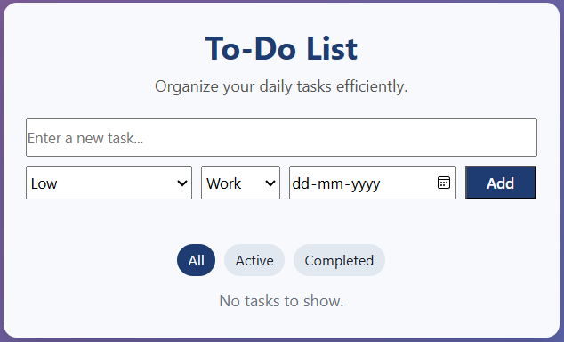
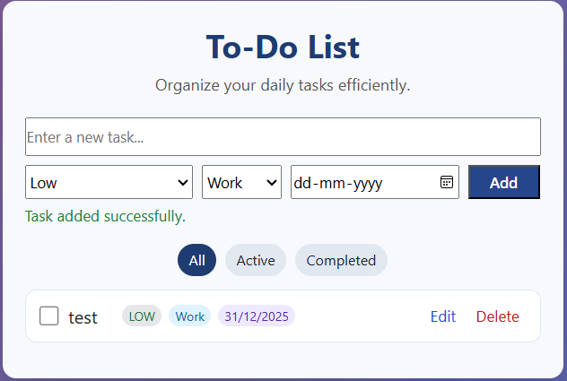
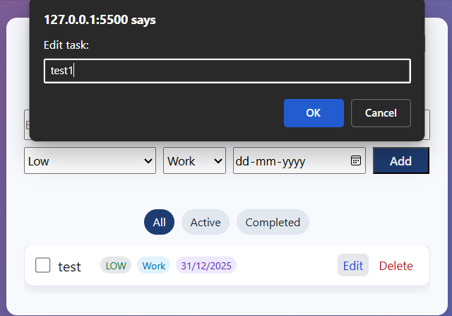
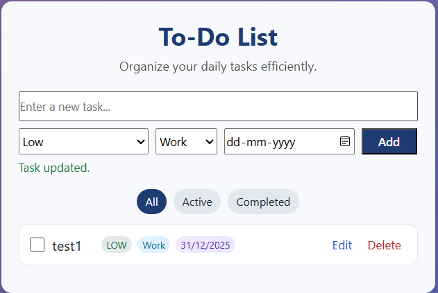
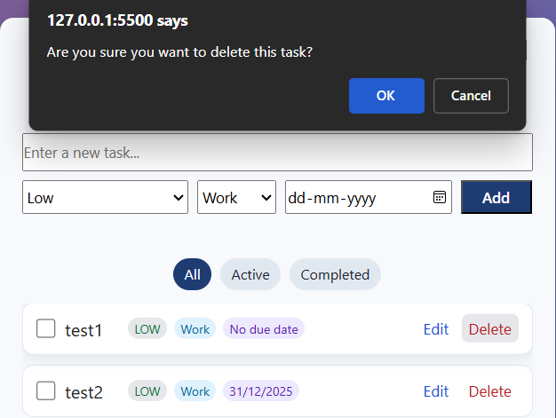
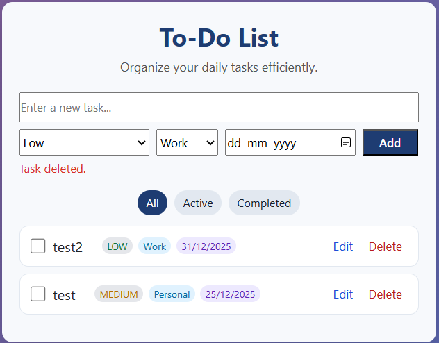
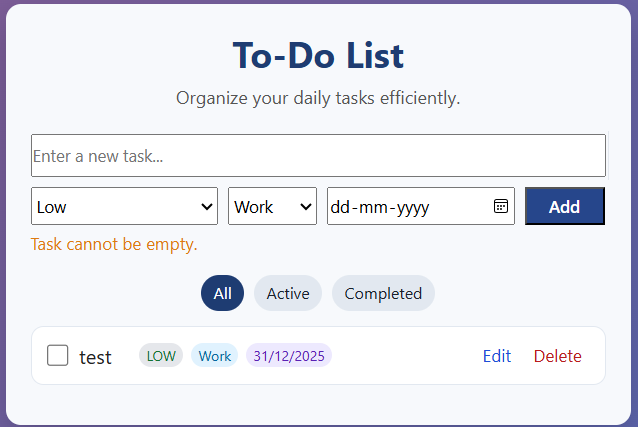
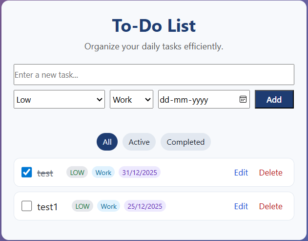
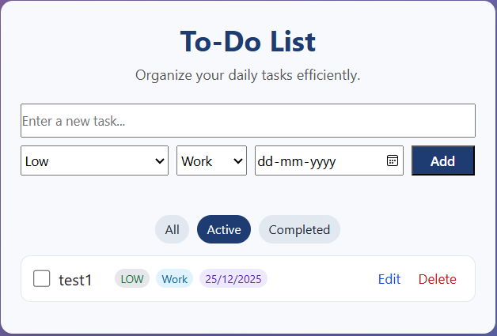
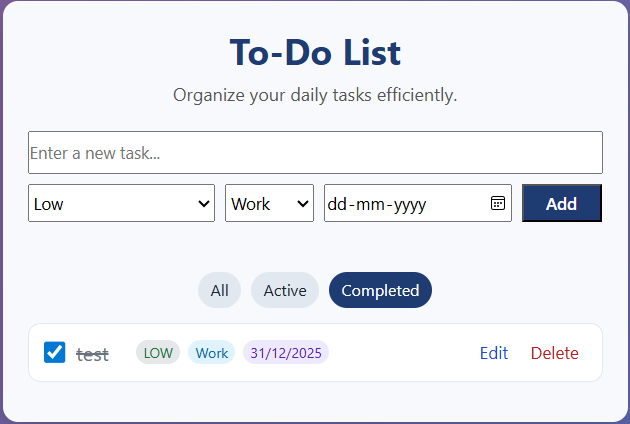

# 📝 To-Do List App

A simple and modern **To-Do List web application** built using **HTML, CSS, and JavaScript**.  
It helps users organize daily tasks with priorities, categories, due dates, and filters.

---

## 🖼️ Preview 

<table>
    <tr>
        <td align="center">
        <h4> TO-Do List Preview </h4>
        
        </td>
        <td align="center">
        <h4> Added New Task</h4>
        
        </td>
    </tr>
    <tr>
        <td align="center">
        <h4> Edit the Task </h4>
        
        </td>
        <td align="center">
        <h4> Edit the task successfully </h4>
        
        </td>
    </tr>
    <tr>
        <td align="center">
        <h4> Delete the task </h4>
        
        </td>
        <td align="center">
        <h4> Deleted the task successfully </h4>
        
        </td>
    </tr>
    <tr>
        <td align="center">
        <h4> Empty task not allowed </h4>
        
        </td>
        <td align="center">
        <h4> All task display </h4>
        
        </td>
    </tr>
    <tr>
        <td align="center">
        <h4> Active task display </h4>
        
        </td>
        <td align="center">
        <h4> Complete task display </h4>
        
        </td>
    </tr>

</table> 

---

## 🚀 Features

- ➕ Add new tasks
- ❌ Prevent duplicate tasks
- 🗑️ Delete tasks
- ✏️ Edit existing tasks
- ✅ Mark tasks as completed
- 🔍 Filter tasks:
  - All
  - Active
  - Completed
- 💾 Persistent storage using **Local Storage**
- 📢 User feedback messages (Success, Error, Alert)

---

## ✨ Additional Features

- 🏷️ **Task Priority**
  - Set task priority as:
    - **Low**
    - **Medium** 
    - **High**

- 📂 **Task Category**
  - Organize tasks into categories:
    - Work
    - Personal
    - Study
    - Other

- 📅 **Due Date Support**
  - Assign a due date to each task
  - Displays formatted date or *No due date* if not provided

---

## 🛠️ Technologies Used

- **HTML5** – Structure  
- **CSS3** – Styling  
- **JavaScript (ES6)** – Logic & functionality  
- **Local Storage API** – Data persistence  

---

## 🧠 Key Functionalities

- ✅ Duplicate Task Prevention

    - Prevents adding the same task twice (case-insensitive)

    - Shows an alert message if a duplicate task is detected

- 💾 Local Storage

    - Tasks are saved automatically

    - Data remains available even after page refresh

---

## 📂 Project Structure

todo-list-app/
│

├── screenshot.png # Screenshot preview

├── index.html      # Main HTML file

├── README.md       # Project documentation

├── script.js       # JavaScript logic

└── styles.css      # CSS styling

